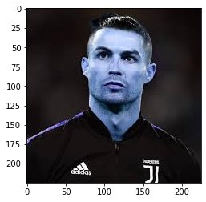
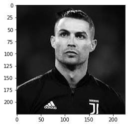
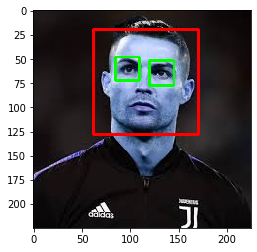
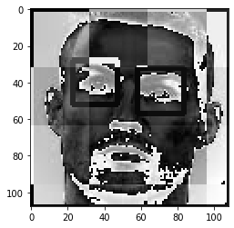
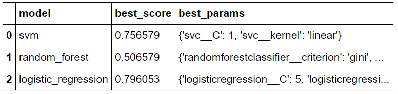
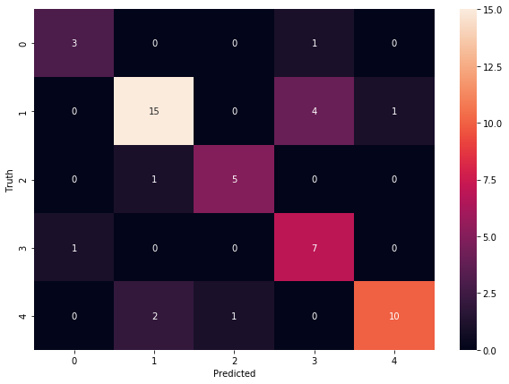

# Image Classifier

# Objective
Model developed to identify an image and classify accordingly.

Image classification falls under classification algorithm of Machine learning.
Classification algorithm works under the premise of finding the pattern and associate it with a class.
In this project, a model is developed to perform similar objective but with a little upgradation.

Similar to the regular numerical nature of data, images are identified by the machine in the form of array consisting of numerical values and depending upon the color scheme it
can be divided into 3 dimension or 2 dimension (i.e, in the case of Black and white image or Gray Scaled image)

# Importing an Image
Using the OpenCV library we import images onto our Jupyter notebook to perform some tests to identify and spot differences.
OpenCV (Open Source Computer Vision Library) is an open source computer vision and machine learning software library that detect and recognize faces to classify human action.

Test Image of Cristiano Ronaldo

Due to the fact it is a coloured image, it has 3 dimensions where the 3rd dimension corresponds to RGB color scheme. In order to avoid complications, we convert the coloured
image in to a Gray scaled image.

# Identifying region of interest
The important part in image classification is identifying the subtle difference in one's facial map and features. 
To accomplish the goal we employ the usage of Haar featured cascade classifier to detect (in this case) face map and eyes. 
By providing the classifier with many photos and negatives, classifier identifies and extracts the object useful for the operations.

Identified region of interest using Haar enabled cascade classifier

# Wavelet transformation of the image
To identify the difference between 2 images, transformation of image is necessary. Wavelet transformation helps in that regard.

The wavelet analysis method is a time-frequency analysis method which selects the appropriate frequency band adaptively based on the characteristics of the signal. 
Then the frequency band matches the spectrum which improves the time-frequency resolution. The wavelet analysis method has an obvious effect on the removal of noise 
in the signal. According to the features of the multi-scale edge of the wavelet, the de-noising method of the orthogonal wavelet transform which based on soft and hard
threshold.

Wavelet transformed image

The images after the transformation is vertically stacked up against the original gray scaled image to form a dataset to employee machine learning algorithm.

# Choosing the Best model
Using GridSearchCv we can identify which model performs best among the various classification algorithms such as-

* Logistic Regression
* Random Forest
* Support Vector Machine (SVM)

GridseachCV not only helps us to choose the best model but also it helps us in achieving highest efficiency by determining best parameters for it.

# Result
We reached the conclusion that out Logistic regression model performs best with a score of 80%

Plotting a relationship between the predicted values and actual values helps in order to rectify the mistakes or check the parameters which can we tweaked.
Seaborn library provides powerful visualization to tackle that problem.

Heatmap corresponding with the True values and Predicted values

# Con
* The classifier requires a large amount of data to perform adequetly, hence it is not advisable to use a small dataset.
